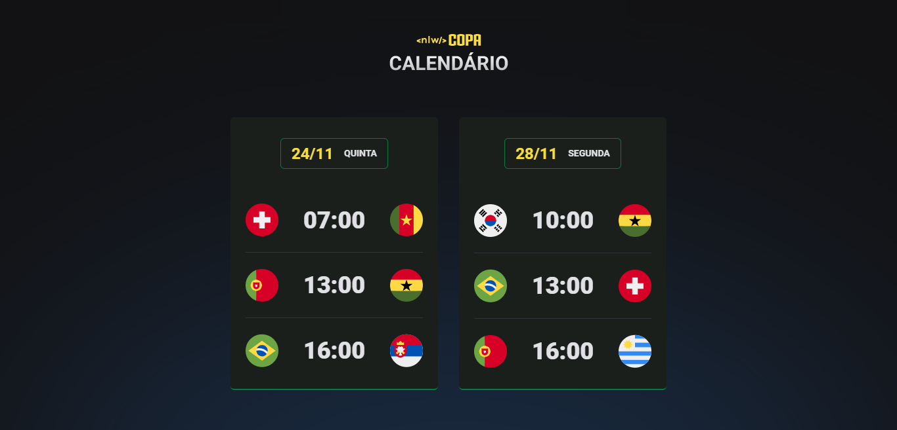

# Calendário de Jogos Copa do Mundo 2022
Projeto criado através da plataforma Rocketseat no evento NLW - Trilha Explorer

## Deploy da aplicação
https://murilonicemento.github.io/game-schedule/
## Tecnologias utilizadas
+ HTML5
+ CSS3
+ JavaScript

## Estrutura do site

## Home

